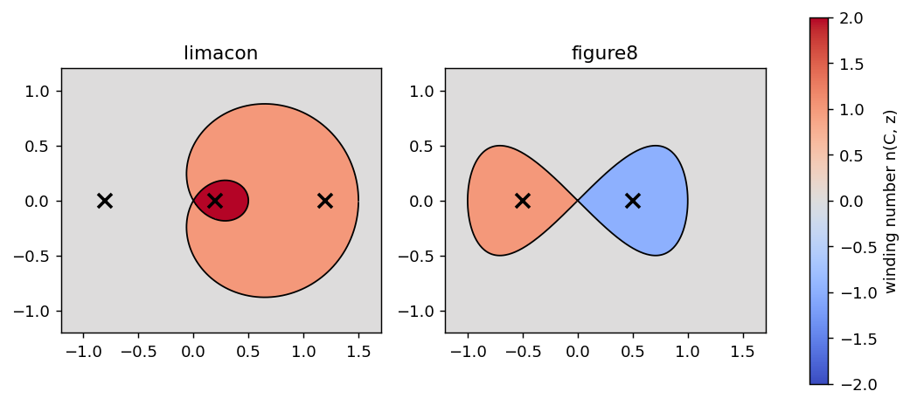
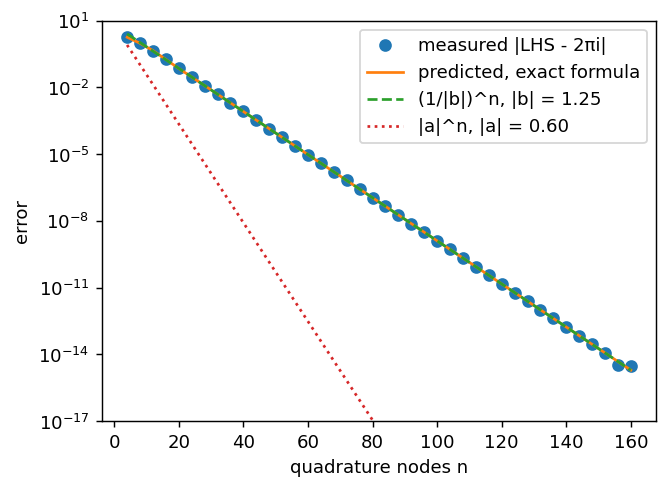
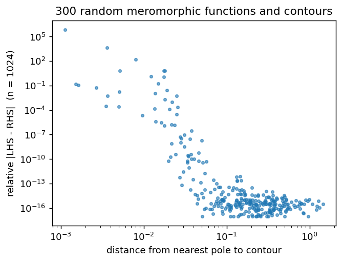

# Stress-Testing the Residue "Conjecture"

Friday agentic session, week 3. Prompt: [../Contour_Integration.md](../Contour_Integration.md).

## The Problem

Pretend nobody has proved

$$\oint_C f(z)\,dz = 2\pi i \sum_k n(C, p_k)\,\mathrm{Res}_{p_k} f .$$

To take it seriously as a conjecture, the two sides have to be computed by code that
**shares nothing**. Otherwise "they agree" only shows that one piece of code agrees
with itself.

| | LHS | RHS |
|---|---|---|
| what | $\oint_C f\,dz$ | $2\pi i\sum n(C,p)\,\mathrm{Res}_p f$ |
| how | numpy quadrature, float64 | sympy finds the poles *exactly*; residues come from Laurent series at 50–90 digits; winding numbers come from counting ray crossings |
| never uses | poles, residues | integration of any kind |

The residue is read off the Laurent series directly. With $h = z - p$ and $f = N/D$,
expand both $N$ and $D$ in Taylor series past their zeros. Then $f = h^{-m} A(h)/B(h)$,
and $\mathrm{Res} = [h^{m-1}]\,A/B$, which comes from power-series division. The winding
number is the signed count of polygon edges that cross a horizontal ray from $p$
(Sunday's algorithm). It is combinatorial and cross-checked against a turning-angle sum.

Files:
- `residue.py` — both engines (~250 lines)
- `checks.py` — the stress tests (`python checks.py`, about 40 s)
- `index.html` — the GUI

## Checks, and why each one is non-trivial

1. **Hand-computed residues.** Seven cases, including a 4th-order pole, $\tan z$,
   $1/\sin^2 z$ (a double pole with residue zero), and $\pi\cot(\pi z)/z^2$ (a triple pole).
   Both sides must match my paper answers.
2. **Winding numbers that are not 0 or 1.** A limaçon $r = \tfrac12 + \cos t$ has an inner
   loop where $n = 2$. A figure-8 has lobes with $n = \pm 1$. The two winding algorithms
   must agree on a 3362-point grid, and LHS = RHS must hold with poles planted in each
   region.
3. **Infinitely many poles.** $\pi\cot(\pi z)/z^2$ on squares of half-width $N+\tfrac12$
   encloses 81 poles at $N = 40$. As a side effect, the LHS alone reproduces
   $\sum_{n\le N} 1/n^2$, so the contour integral "knows" the Basel sum.
4. **The quadrature error is predicted exactly, not just its scaling.** Sum a geometric
   series over the roots of unity. The trapezoid rule on $|z|=1$ with $n$ nodes then
   gives exactly $2\pi i/(1-a^n)$ for $1/(z-a)$ with $|a|<1$, and
   $-2\pi i\, b^{-n}/(1-b^{-n})$ for $|b|>1$. The measured error must follow this to
   the last digit.
5. **300 random functions on random contours.** Each has 1–5 planted poles of order 1–3
   at random rational points, a random numerator, and a random smooth star-shaped
   contour. The pole finder must recover the planted poles and orders, and the
   theorem must hold.
6. **Break the hypotheses on purpose.** A skeptic should see the "conjecture" *fail*
   when its assumptions do:
   - Inputs that aren't meromorphic ($\sqrt z$, $\log z$, $\bar z$, $e^{1/z}$) must be
     refused by the RHS, not silently summed as "no poles, so 0".
   - A pole *on* the contour must give the principal value, $\pi i$ instead of $2\pi i$.

## Results

All 11 checks pass:

```
[PASS] hand-computed residues: worst |side - exact| = 8.9e-16
[PASS] crossing count == turning angle: 0 disagreements on 3362 grid points
[PASS] multi-winding contour (limacon): |LHS-RHS| = 3.6e-15
[PASS] multi-winding contour (figure8): |LHS-RHS| = 3.7e-15
[PASS] 81 poles of cot(pi z)/z^2 inside a square: worst |LHS-RHS| = 1.8e-15
[PASS] LHS alone reproduces the partial sums of 1/n^2
[PASS] trapezoid error == closed-form prediction: max |measured - predicted| = 2.5e-15
[PASS] pole finder recovers the planted poles and orders: 300/300
[PASS] random functions, poles >= 0.1 from contour: 198 cases, worst relative |LHS-RHS| = 7.5e-13
[PASS] non-meromorphic inputs are refused, not silently summed
[PASS] pole on the contour gives the principal value pi*i
```





The measured error sits on the predicted curve over 15 decades. The pole outside the
circle ($|b| = 1.25$) controls the error, not the one inside ($|a| = 0.6$): the error
falls like $\max(|a|, 1/|b|)^n$.



This is where the "conjecture" looks shakiest, and it is the quadrature's fault, not
the theorem's. With a fixed 1024 nodes, agreement degrades steadily as the nearest
pole approaches the contour. This is check 4's law again: the convergence rate is set
by the distance from the contour to the nearest singularity.

## What the random test caught

The hand-built checks passed on the first try. The random test found **three real bugs
in the RHS**, which is the best argument for having it:

1. **sympy hung** finding the roots of linear factors with complex coefficients. I had
   multiplied by the conjugate polynomial so I could use `CRootOf`. Fix: use the
   closed-form `roots` for degree ≤ 4.
2. **A fixed "is this zero?" threshold is wrong.** Denominator Taylor coefficients ranged
   from $10^{-130}$ to $10^{22}$, so rounding noise on an exact zero could exceed $10^{-30}$.
   Order-3 poles were read as order 2 (29/300 cases, some wrong by 100%). Fix: a
   coefficient counts as zero if it is $10^{40}$ smaller at $p$ than at a point
   $10^{-3}$ away. Near a zero of order $m$ it grows like $\eta^{m-k}$; a genuine value
   barely changes over that distance.
3. **A silent precision leak.** `sympy.lambdify(..., 'mpmath')` prints $i$ as the
   float64 constant `1j`, so the "50-digit" arithmetic was quietly capped at 16 digits.
   Fix: pass $i$ in as an mpmath argument.

None of these would have shown up on textbook examples with nice poles.

## Push Harder: the GUI

`index.html` runs **the same `residue.py`** in the browser via Pyodide, so the GUI
cannot drift from the tested code. Type $f(z)$ and the poles appear on a phase portrait
(hue = $\arg f$, bands where $|f|$ doubles). Draw a contour freehand, as a circle, or as
a polygon. The app shades each region by its winding number, and shows LHS, RHS, their
difference, and a table of enclosed poles with their order, residue, and $n(C,p)$.
Things to try:
- Loop twice around a pole of $\tan z$: $n = 2$.
- Draw a figure-8 around its two poles: $\pm1$ cancels to 0.
- Pass a contour close to a pole and watch the agreement degrade.
- Enter `sqrt(z)` and see it refused on the RHS.

Polygon edges are split into pieces no longer than 1% of the view before the Gauss
nodes go on. Without this, one long edge near a pole gets only 16 nodes (found while
testing: a triangle near a pole of $\cot$ gave $2\times10^{-6}$ instead of $10^{-14}$).

Run it locally (Pyodide needs HTTP, not `file://`):

```bash
python3 -m http.server 8000
```

then open <http://localhost:8000>. The first load fetches numpy/sympy (~10 s). It is a
single static file, so it can go straight onto the github.io portfolio.

## Push Even Harder — ideas not yet done

- **Essential singularities.** The theorem still holds for $e^{1/z}$ (the residue is 1).
  The RHS refuses it only because my pole finder looks at denominators. A Laurent
  expansion at infinity would cover it.
- **Adaptive LHS.** Place nodes by the distance to the nearest *numerically detected*
  singularity. That would use no information from the RHS, and could fix the lower-left
  part of the random-test figure.
- **Counting zeros.** Apply the argument principle, $\frac{1}{2\pi i}\oint f'/f = Z - P$,
  as a third, independent test of the same machinery.

## Honest accounting

Built with Claude Code in one session: the agent wrote the code, designed the checks,
and found and fixed the three bugs above by following the failing random cases.
